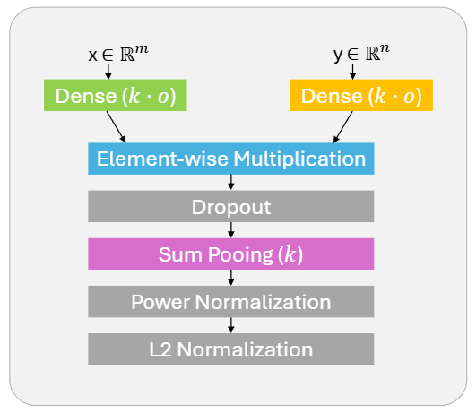
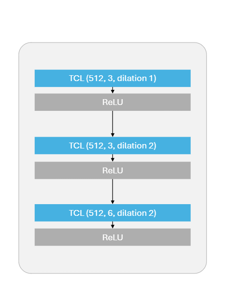

# Visual Question Answering (VQA) on Edge Devices

## 1. Introduction

This repository provides a hands-on tutorial, on how to design and train **Visual Question Answering (VQA)** models for **resource-constrained edge devices**, specifically the **STM32MP2 platform**. The code is written in **Python** and the models are implemented in **Keras**.
By following this tutorial, you will obtain fully trained VQA models that are optimized for the STM32MP2 platform and can leverage its NPU for efficient inference.

The workflow includes:

1. Model architecture design
2. Dataset preparation and preprocessing
3. Training with Knowledge Distillation (KD)
4. Results and Deployment Analysis on STM32MP2

This README is structured as follows:

- **Tutorial** – overview of the model architectures, dataset preparation, and training procedure, providing all the necessary information to reproduce the VQA models adapted to STM32MP2.
- **Usage** – instructions on how to install, train, and evaluate the models.
- **Code Details** – additional details about the code implementation.

---

## 2. Tutorial: VQA on Edge Devices

### 2.1 Model Architectures

The implemented models are based on the architectures proposed by [**Yu et al. (2017)**](https://openaccess.thecvf.com/content_iccv_2017/html/Yu_Multi-Modal_Factorized_Bilinear_ICCV_2017_paper.html):

- **MFB Baseline**

  - Image features: extracted with ResNet-152 pre-trained on ImageNet.
  - Question features: word embeddings + two-layer LSTM network.
  - Fusion: MFB module combines image & question features.
  - Classifier selects the most likely answer from a predefined set of possible answers.

  <p align="center">
  
  </p>
  <p align="center"><i>Figure 1. MFB module proposed by Yu et a. (2017), k and o are hyper-parameters of the module.</i></p>

- **MFB + Attention**

  - Same as Baseline, with an **attention mechanism over image features**.
  - Uses two MFB modules, one before and one after the attention.

- **MFB + CoAttention**
  - Most powerful variant according to Yu et al. (2017).
  - Same as MFB + Attention, but also applies **attention over question features**.

#### Optimizations for STM32MP2

The original architectures were modified to make them efficient on the STM32MP2 platform and leverage hardware acceleration (designed for forward CNNs):

- **ResNet-152 → MobileNet V3 Large**
  - Lighter, optimized for edge devices.
- **LSTM → Block of Temporal Convolutional Layers (TCLs)**
  - Faster and hardware-friendly sequence modeling.
- **MFB module simplification**
  - Removed power normalization
  - Sum pooling → average pooling
  - Parameters: `k = 5`, `o = 1024`

Additional improvements:

- **Word embeddings**: concatenation of **pretrained GloVe embeddings** and **learned embeddings**
  - Introduced to improve semantic representation and boost model performance.

**Resulting architectures**: efficient and suitable for deployment on edge devices.


_Figure 2. Optimized MFB with Co-Attention network. The MFB with Attention and Baseline variants are derived by removing, respectively, the question attention block, and both the question and image attention blocks along with the first MFB module._

<p align="center">

</p>
<p align="center"><i> Figure 3. Temporal Convolutional (TC) block replacing LSTM </i></p>

### 2.2 Dataset and Preprocessing

The dataset considered for this tutorial is the **VQAv2 dataset** ([Goyal et al., 2017](https://openaccess.thecvf.com/content_cvpr_2017/html/Goyal_Making_the_v_CVPR_2017_paper.html)).  
Each sample contains:

- An image
- A natural language question
- Ten human-provided answers + one ground truth answer

Dataset: [VQAv2 official website](https://visualqa.org/)

#### Dataset splits

| Set        | Questions | Images |
| ---------- | --------- | ------ |
| Training   | 443,757   | 82,783 |
| Validation | 214,354   | 40,504 |
| Test       | 447,793   | 81,434 |

Because the test set does not include ground truth or human-provided answers, **all evaluations in this tutorial were carried out on the validation set.**

#### Answer preprocessing

- Normalized according to the official preprocessing guidelines (lowercase, digits, removed articles, etc.).
- Only the **1000 most frequent answers** retained (standard VQA practice).
- Training set reduced to ~87.5% of original size, and this reduced set was used for training.
- As a result, the model can only predict one of these 1000 possible answers.

#### Image preprocessing

- Resized to **224×224** and normalized to range **[-1, 1]** (MobileNet input format).

#### Question preprocessing

- Tokenized and padded/truncated to **15 tokens**.
- Vocabulary: **6415 words** (words appearing ≥5 times).
- Unknown words replaced with `<unk>`.

### 2.3 Training Procedure

#### Knowledge Distillation (KD)

Instead of training from scratch, models are trained using **knowledge distillation** ([Hinton et al., 2015](https://arxiv.org/abs/1503.02531)):

**Teacher model:** BEiT-3 ([Wang et al., 2023](https://openaccess.thecvf.com/content/CVPR2023/html/Wang_Image_as_a_Foreign_Language_BEiT_Pretraining_for_Vision_and_CVPR_2023_paper.html)) fine-tuned on VQAv2 [(beit3_large_indomain_patch16_224)](https://github.com/microsoft/unilm/tree/master/beit3#fine-tuning-on-vqav2-visual-question-answering) (82.53% accuracy on test-dev, 683M parameters).

#### Loss function

The loss combines two terms:

- **Student loss**: cross-entropy (CE) with ground truth labels (_y_).
- **Distillation loss**: Kullback–Leibler (KL) divergence between teacher logits (_t_) and student logits (_s_).

<p align="center">

</p>

Parameters used:

- Temperature `T = 3`
- Balance coefficient `α = 0.1`

#### Class imbalance handling

Since _yes/no_ answers represent ~40% of the dataset, **sample weights** inversely proportional to answer frequency were applied.

#### Training setup

- GPU: NVIDIA GeForce GTX 1060 (6 GB)
- Optimizer: **Adam**, learning rate `1e-4`
- Epochs: **10** (~1 hour per epoch, ~10 hours total per model)

### 2.4 Results and Deployment Analysis

The performance of VQA models is measured by comparing the model’s predicted answers to the human-provided reference answers ([Antol et al., 2015](https://openaccess.thecvf.com/content_iccv_2015/html/Antol_VQA_Visual_Question_ICCV_2015_paper.html)). Given the model’s predicted answer _a<sub>i</sub>_ for question _i_, and the ten human-provided reference answers, the accuracy of a model is computed as follows:

<p align="center">

</p>

where _N_ is the number of questions and _count(a<sub>i</sub>)_ denotes the number of annotators who provided the answer _a<sub>i</sub>_ to question _i_.

#### VQA Performance (Overall and fby Answer Type)

We report the accuracy both overall and split by answer type:

- **Overall**: accuracy across the full validation set
- **Yes/No**: accuracy for Yes/No questions
- **Number**: accuracy when the expected answer is a number
- **Other**: accuracy for all remaining cases

| Model        | #Params | Overall (%) | Yes/No (%) | Number (%) | Other (%) |
| ------------ | ------- | ----------- | ---------- | ---------- | --------- |
| MFB Baseline | 24.4M   | 56.0        | 76.7       | 36.5       | 45.4      |
| MFB + Att.   | 40.4M   | **57.0**    | **77.7**   | **37.2**   | **46.5**  |
| MFB + CoAtt. | 51.2M   | 56.4        | 76.9       | 36.8       | 46.1      |

The best-performing model is **MFB + Attention**, which was then deployed on the STM32MP2 platform.

#### STM32MP2 Inference Performance

| Model      | Execution Device | Inference time (ms) | Power (W) |
| ---------- | ---------------- | ------------------- | --------- |
| MFB + Att. | GPU/NPU          | **56**              | **0.75**  |
| MFB + Att. | CPU              | 434                 | 0.80      |

The results show that **MFB + Attention** achieves efficient inference on STM32MP2, with significantly faster execution and lower power consumption when using the GPU/NPU compared to CPU execution.

---

## 3. Usage

### 3.1 Data Setup and External Resources

Before running the code, make sure to download and place the required external resources in the appropriate folders:

1. **VQAv2 Dataset**

- Download the dataset from the [official website](https://visualqa.org/).
- Place the images and annotation files in a folder like:
  ```
  data/vqa_dataset/
      ├── train2014/
      ├── val2014/
      ├── v2_mscoco_train2014_annotations.json
      ├── v2_mscoco_val2014_annotations.json
      ├── v2_OpenEnded_mscoco_train2014_questions.json
      └── v2_OpenEnded_mscoco_val2014_questions.json
  ```

2. **Teacher model logits (for Knowledge Distillation)**

   - Precomputed logits from the BEiT-3 teacher model (or any other teacher model) are required if you want to train using knowledge distillation (KD).
   - Save them in a folder structure like this:

     ```
     data/teacher_logits/
          ├── answer2label.txt
          ├── train_logits/
          │   ├── question_id.json
          │   └── ...
          └── val_logits/
              ├── question_id.json
              └── ...
     ```

     - `answer2label.txt` contains one dictionary per line with keys `answer` and `label`. It maps each possible teacher answer to its corresponding label, which indicates the index of the answer in the logits output of the teacher model.
     - Each `question_id.json` file contains a dictionary with question-related information (question ID, image ID, ground truth answer, model answer, etc.) and a `logits` key containing the teacher model output logits.

   - **Optional:** If teacher logits are not available, you can still train the model from scratch by adjusting the configuration file accordingly (see Section 3.3).

3. **GloVe embeddings**

   - Download GloVe embeddings (i.e., `glove.6B.zip`) from [GloVe site](https://nlp.stanford.edu/projects/glove/).
   - Unzip the file and place it in:
     ```
     data/
      └── glove.6B
     ```
   - **Optional:** you can still train the model without GloVe embeddings by adjusting the configuration file accordingly (see Section 3.3).

### 3.2 Installation

Clone the repository and install the required Python packages:

```bash
git clone https://github.com/GloriaGio/vqa-stm32mp2.git
cd vqa-stm32mp2
pip install -r requirements.txt
```

#### Using the provided trained models

If you want to try or use the models already trained in this tutorial instead of training yourself, download the files from [this Drive link](https://drive.google.com/drive/folders/1iK-X6BriZnWhiYlnYmqM-lG5ooZXPkES?usp=drive_link) and place them in the `outputs` folder.

```
outputs/
  ├── MFBBaseline/
  │   ├── used_config.json              # configuration used for trainig (as described in Section 2)
  │   ├── trained_MFBBaseline.keras     # trained model in Keras format
  │   ├── trained_MFBBaseline.tflite    # trained model in TFLite format
  │   └── val2014_accuracy.json         # accuracy on validation set
  ├── MFBAttention/
  │   ├── used_config.json
  │   ├── trained_MFBAttention.keras
  │   ├── trained_MFBAttention.tflite
  │   └── val2014_accuracy.json
  ├── MFBCoAttention/
  │   ├── used_config.json
  │   ├── trained_MFBCoAttention.keras
  │   ├── trained_MFBCoAttention.tflite
  │   └── val2014_accuracy.json
  ├── possible_answers_ct1000.json      # list of possible answers for all models
  └── word_index_mf5.json               # word-to-index mapping used by the tokenizer
```

### 3.3 Set Configuration

All training and evaluation settings are stored in the `config.json` file located in the root of the repository.  
This file contains three sections: **model**, **training**, and **paths**.

The file can be edited manually with any text editor.  
At runtime, values in `config.json` are loaded as defaults.

> ⚠️ Parameters provided via command-line arguments (e.g. `--model-arch`, `--epochs`) will **override** the corresponding values in `config.json` (see Section 3.4).

#### Model parameters

- `model_architecture`: VQA model architecture. Options: `MFBBaseline`, `MFBAttention`, `MFBCoAttention`.
- `max_length`: sequence length for tokenized questions (padded or truncated to `max_length`).
- `num_vocab_words`: size of the vocabulary for word embeddings (if set to `-1`, the vocabulary size is determined by `min_frequency`).
- `min_frequency`: minimum frequency for a word to be included in the vocabulary (set to `0` if `num_vocab_words` > 0).
- `image_size`: size of the input images (e.g. `224` for `224×224`).
- `num_channels`: number of image channels (`3` = RGB, `1` = grayscale).
- `num_classes`: number of possible answers (the model classifies among this set).
- `consider_teacher`: (`true`/`false`) whether to restrict answers to those used by the teacher model (useful for knowledge distillation or for comparing models trained with and without KD on the same set of answers). **Set to `false` if you don't want to use knowledge distillation.**
- `k_window`: hyperparameter _k_ of the MFB module.
- `output_MFB`: hyperparameter _o_ of the MFB module.
- `num_attention_glimps`: number of attention glimpses (outputs are concatenated after Global Avg Pooling).
- `use_glove`: (`true`/`false`) whether to use GloVe embeddings in addition to learned embeddings. **Set to `false` if you don't want to use GloVe embeddings.**
- `embedding_dim`: dimension of the word embeddings (applies to both GloVe and learned embeddings).
- `dropout_rate`: dropout rate applied during training.

#### Training parameters

- `num_epochs`: number of training epochs.
- `lr`: learning rate.
- `batch_size`: batch size for training.
- `alpha`: balancing coefficient for KD loss.
- `temperature`: softmax temperature (T) for KD.
- `knowledge_distillation`: (`true`/`false`) whether to use KD during training. If `consider_teacher` is `false` than `knowledge_distillation` is set to false too. If `consider_teacher = true, knowledge_distillation = false` answers are restricted to those used by the teacher model, but models are trained from scratch.
- `restore_best_weights`: (`true`/`false`) whether to restore the best model (based on validation loss) or keep the final epoch model.

#### Paths

- `dataset_path`: path to the VQAv2 dataset (e.s. `.../data/vqa_dataset`).
- `glove_path`: path to the GloVe embeddings (e.s. `.../data/glove.6B`).
- `KD_path`: path to teacher logits (used if KD is enabled, e.s. `...data/teacher_logits`).
- `output_path`: output folder where trained models, configs, and results are saved (e.s. `outputs`).

### 3.4 Training a model

To train a VQA model, you need to first configure the training parameters in the `config.json` file.

Once the configuration is set, you can start training using one of the following options:

1. Train using the parameters in `config.json`:

```bash
python main_train.py
```

2. Override configuration from the command line:

To change the model architecture (`MFBBaseline`, `MFBAttention`, or `MFBCoAttention`), number of epochs, or batch size:

```bash
python main_train.py --model-arch MFBBaseline --epochs 10 --batch_size 32
```

To disable knowledge distillation and train from scratch:

```bash
python main_train.py --disable-KD
```

All other parameters not specified in the command line will be taken from `config.json`.

At the end of the training, a new folder will be created in `outputs` folder containing:

- the **trained model** saved in `.keras` format,
- the **configuration file** used for training, updated to reflect any parameter changes made via command-line arguments or automatic adjustments for incompatible values,
- a JSON file with **preliminary performance metrics** (training/validation standard accuracy and loss on filtered dataset).

### 3.5 Evaluation

```bash
python main_eval.py --model-dir MFBBaseline --split val2014 --batch-size 32
```

where:

- `--model-dir` specifies the folder containing the trained model (created during training),
- `--split` defines which dataset split to evaluate on (`train2014` or `val2014`),
- `--batch-size` sets the evaluation batch size (if not specified, the value from the training configuration will be used).

After evaluation, the code will save:

- a JSON file with the evaluation metrics (accuracy per question type and overall accuracy)
- a JSON file containing each question ID along with the answer predicted by the model.

### 3.6 Inference

The script processes the question and image through the selected VQA model and prints the predicted answer to the console.

```bash
python inference.py --model-dir MFBBaseline --question "What is this?" --image-path ...data/vqa_dataset/val2014/COCO_val2014_000000002006.jpg
```

where:

- `--model-dir` specifies the folder containing the trained model,
- `--question` is the natural language question to ask about the image,
- `--image-path` is the path to the image file.

### 3.7 TFLite Conversion

The script converts the Keras model to TFLite format, applying per-tensor quantization. The resulting .tflite model is saved in the same folder as the original model.

```bash
python convert.py --model-dir MFBBaseline
```

where:

- `--model-dir` specifies the folder containing the trained model.

---

## 4. Code Details

The repository uses **Keras** as the deep learning framework.  
This section mirrors the theoretical tutorial but provides additional details about the code implementation.

### 4.1 Model Architectures

The folder `models/` contains the file `vqa_models.py`, which defines the implemented model architectures:

- `MFB_Baseline(...)`: Keras implementation of the modified **MFB Baseline** model.
- `MFB_Attention(...)`: Keras implementation of the modified **MFB + Attention** model.
- `MFB_CoAttention(...)`: Keras implementation of the modified **MFB + CoAttention** model.
- `get_model(config)`: Utility function that instantiates the correct model given a configuration dictionary.

Each function returns a fully built **Keras model** (`tf.keras.Model`), with layers and parameters defined according to the provided configuration. While the theoretical section provides high-level block diagrams of the architectures, these functions show the **exact Keras implementation** of each model.

### 4.2 Dataset and Preprocessing

The folder `data/` contains everything related to dataset handling and preprocessing.

- **Dataset loading**

  - The function `get_vqav2(...)` in `dataset.py` loads the official VQAv2 JSON files into **Pandas DataFrames** and applies **answer normalization** (as described in the theoretical section).
  - The function `get_filtered_trainval(...)` builds on top of `get_vqav2(...)`: it loads the training and validation sets, filters them to retain only the **top 1000 most frequent answers** in the training set, and returns the filtered splits.

- **Data generators**  
  Defined in `custom_generators.py`. They are implemented as subclasses of `keras.utils.Sequence`, so they can be used directly with `model.fit()`.

  `Custom_Generator` (training and evaluation):

  - Loads and preprocesses images (resize, normalization).
  - Tokenizes and pads/truncates questions.
  - One-hot encodes ground-truth answers.
  - Loads **teacher logits** (if KD is enabled).
  - Applies **per-sample weighting** for imbalanced answers.

In practice, these generators handle the entire preprocessing pipeline and supply batches ready for training/evaluation.

### 4.3 Training Procedure

The training workflow is split across two components:

- `main_train.py`:

  - Loads the dataset and builds the custom generators.
  - Creates the model (based on the configuration).
  - Selects the appropriate training routine (from scratch or with KD).
  - Saves the trained model and related files into an `outputs/` subfolder.
  - Evaluates preliminary metrics (standard accuracy and loss on filtered train/validation sets).

- `trainer.py`, that provides two functions for the actual training step:

  - **Training from scratch** (`train_from_scratch(...)`):

    - Calls `model.compile()` with **Adam optimizer** and **cross-entropy loss**.
    - Defines Keras callbacks (callbacks can be customized in this file).
    - Runs `model.fit(...)` and returns the trained model.

  - **Training with Knowledge Distillation (KD)** (`train_with_KD(...)`):

    - Wraps the model inside a custom `Distiller(keras.Model)` class (see [Keras KD Code Examples](https://keras.io/examples/)).
    - Compiles the distiller with:
      - Optimizer: **Adam**
      - Losses: **cross-entropy** (student) + **KL divergence** (distillation)
      - KD parameters: `alpha` and `T` (from config).
    - Defines Keras callbacks (callbacks can be customized in this file).
    - Runs `distiller.fit(...)` to train the student model.
    - Returns the trained student model (not the distiller).

  Both functions handle validation during training and return a trained model.

### 4.4 Evaluation

The evaluation pipeline is handled by `main_eval.py`.  
Its tasks are:

- **Obtain model answers**  
  For the selected dataset split (`train2014` or `val2014`), answers are either loaded from a pre-computed file inside the model folder, or computed using the model and saved for future runs.
- **Compute accuracy**  
  Model answers are compared with the 10 human annotators’ answers. Accuracy is computed as described in Section 2.4, both **overall** and **per answer type**.
- **Save results** as JSON file in the model folder.

---

## References

- Z. Yu, J. Yu, J. Fan, and D. Tao, **"Multi-modal factorized bilinear pooling with co-attention learning for visual question answering,"** in _Proceedings of the IEEE international conference on computer vision_, 2017
- S. Antol, A. Agrawal, J. Lu, M. Mitchell, D. Batra, C. L. Zitnick, and D. Parikh, **“Vqa: Visual question answering,”** in _Proceedings of the IEEE international conference on computer vision_, 2015,
- Y. Goyal, T. Khot, D. Summers-Stay, D. Batra, and D. Parikh, **“Making the v in vqa matter: Elevating the role of image understanding in visual question answering,”** in _Proceedings of the IEEE conference on computer vision and pattern recognition_, 2017
- W. Wang, H. Bao, L. Dong, J. Bjorck, Z. Peng, Q. Liu, K. Aggarwal, O. K. Mohammed, S. Singhal, S. Som, and F. Wei, **“Image as a foreign language: BEiT pretraining for vision and vision-language tasks,”** in _Proceedings of the IEEE/CVF Conference on Computer Vision and Pattern Recognition_, 2023.
- G. Hinton, O. Vinyals, and J. Dean, **“Distilling the knowledge in a neural network,”** 2015.
